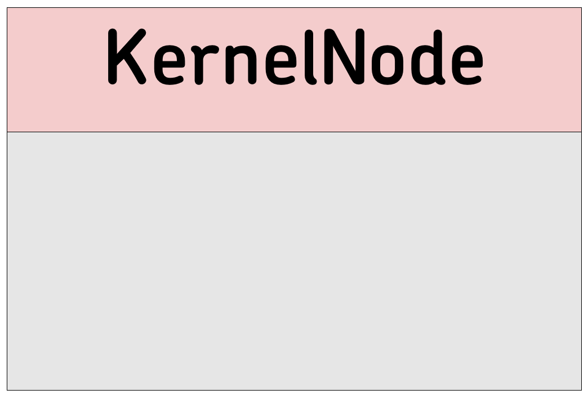
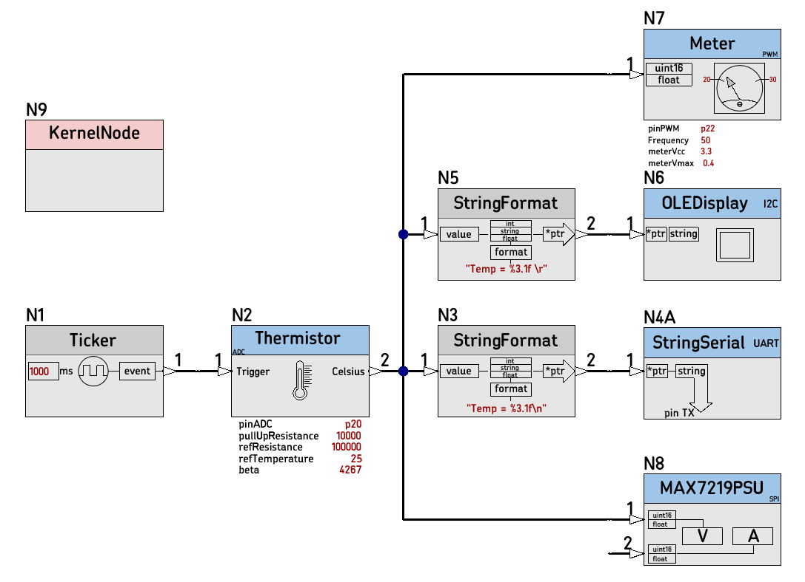
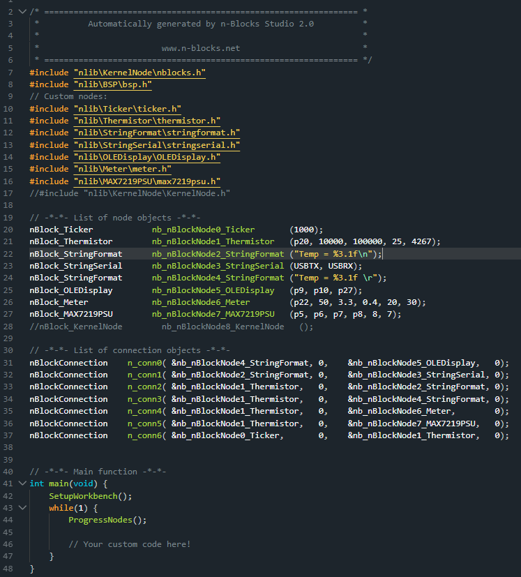

# [KernelNode](https://github.com/nBlocksStudioNodes/nblocks_kernelnode)

This Node is the firmware kernel for n-Blocks Studio 2.0

----

<p align="center">

</p>

----

 *  STATUS: Experimental
 *  Proof of Concept tested :heavy_check_mark:
 *  studio2.0 (local) folder: removed all files from inside the  kernel folder except the readme.md :heavy_check_mark:
 *  nBlocksStudio command-line Translation works :heavy_check_mark:
 *  Automatic code generation :heavy_check_mark:
    *  No manual edit to main.cpp :x:
 
 
 ## Todo
 The studio2.0 command line tool has to be updated to create automatically, what is edited manually:
 *  Autocreated main.cpp needs 3 lines to be modified manually :heavy_check_mark:
    *  `#include "nlib\nblocks.h"` becomes `#include "nlib\KernelNode\nblocks.h"`
    *  `//#include "nlib\KernelNode\KernelNode.h"` made comment
    *  `//nBlock_KernelNode        nb_nBlockNode8_KernelNode   ();` made comment


## Usage in a Schematic Design

A working Schematic Design

<p align="center">

</p>

----

The working (automatically created) main.cpp  
3 lines are manually edited: 
 *  Line 7
 *  Line 17
 *  Line 28

 <p align="center">

</p>

----

## Braistorming notes

### include nblocks.h
`#include "nlib\nblocks.h"` becomes `#include "nlib\KernelNode\nblocks`

This change in the main.cpp can be avoided by leaving the `nblocks.h` inside the `studio2.0/kernel` directory and changing its content from:

```cpp
#include "mbed.h"
#include "nworkbench.h"
```

to

```cpp
#include "mbed.h"
#include "KernelNode/nworkbench.h"
```

### Removing from main.cpp the lines that instantiate the KernelNode as a Node

An updated command-line-tool is need: 2 options proposed:  
1) Update the command line tool to 'trap' the name 'KernelNode': Simple but not elegant
2) the node.json for the Kernel Node to have a 'flag' indicating it is a Kernel Node and an updated command-line-tool that detects the flag. This allows any name to be used for the KernelNode 
